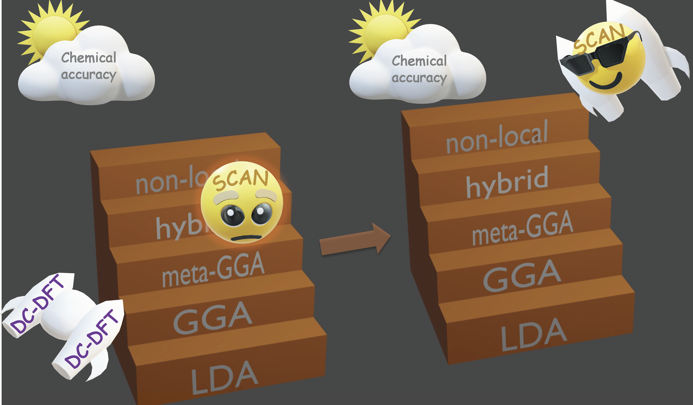

Elevating Density Functional Theory to Chemical Accuracy for Water Simulations through a Density-Corrected Many-Body Formalism
 
 Kohn-Sham density functional theory (DFT) has been extensively used to model the properties of water. Albeit maintaining a good balance between accuracy and efficiency, no density functional has so far achieved the degree of accuracy necessary to correctly predict the properties of water across the entire phase diagram. The recent development of the strongly constrained and appropriately normed (SCAN) functional has renewed the interest in ab initio simulations of liquid water, yielding promising results that are, however, still unable to reproduce all the experimental data. Here, we present density-corrected SCAN (DC-SCAN) calculations for water which, minimizing density-driven errors, elevate the accuracy of the SCAN functional to that of coupled cluster theory, the “gold standard” for chemical accuracy. Building upon the accuracy and efficiency of DC-SCAN within a many-body formal- ism, we introduce a data-driven many-body potential energy function, the MB-SCAN(DC) PEF, that is able to quantitatively reproduce coupled cluster reference values for interaction, binding, and individual many-body energies of water clusters. Importantly, the properties of liquid water calculated from molecular dynamics simulations carried out with the MB- SCAN(DC) PEF are found to be in excellent 
 
