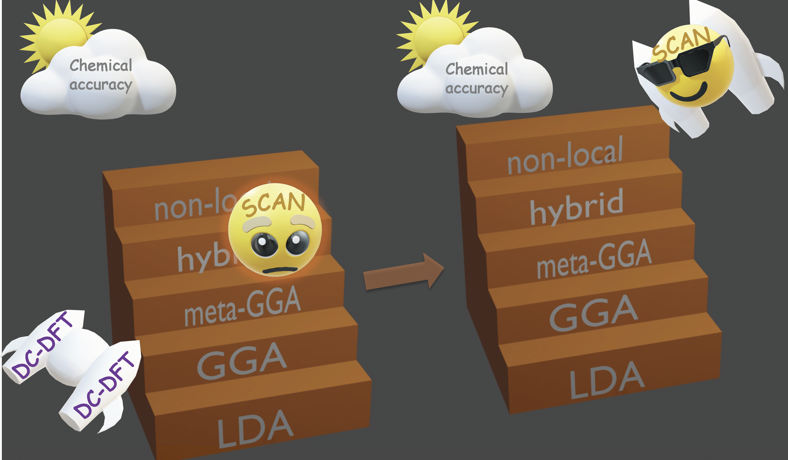

Elevating Density Functional Theory to Chemical Accuracy for Water Simulations through a Density-Corrected Many-Body Formalism

{: style="float: right"}{: height="300px" width="360px"}
 Kohn-Sham density functional theory (DFT) has been extensively used to model the properties of water. Albeit maintaining a good balance between accuracy and efficiency, no density functional has so far achieved the degree of accuracy necessary to correctly predict the properties of water across the entire phase diagram. The recent development of the strongly constrained and appropriately normed (SCAN) functional has renewed the interest in ab initio simulations of liquid water, yielding promising results that are, however, still unable to reproduce all the experimental data. Here, we present density-corrected SCAN (DC-SCAN) calculations for water which, minimizing density-driven errors, elevate the accuracy of the SCAN functional to that of coupled cluster theory, the “gold standard” for chemical accuracy. Building upon the accuracy and efficiency of DC-SCAN within a many-body formal- ism, we introduce a data-driven many-body potential energy function, the MB-SCAN(DC) PEF, that is able to quantitatively reproduce coupled cluster reference values for interaction, binding, and individual many-body energies of water clusters. Importantly, the properties of liquid water calculated from molecular dynamics simulations carried out with the MB- SCAN(DC) PEF are found to be in excellent
{: style="text-align: justify"}

## Publications

"Sceptic priors and climate consensus." Published in **<i>Climatic Change</i>**, 2021 (166:7). [Paper](https://rdcu.be/cle8u){:target="_blank"}. [Pre-print](https://grantmcdermott.com/papers/sceptic.pdf){:target="_blank"}. [Code](https://github.com/grantmcdermott/skeptic-priors){:target="_blank"}.

"Alternate explanations for the blue paradox do not withstand statistical scrutiny." With Kyle C. Meng, Gavin G. McDonald and Christopher J. Costello. Published in **<i>Proceedings of the National Academy of Sciences</i>**, 115 (52), E12124–E12125, 2018. ([Paper](https://doi.org/10.1073/pnas.1818687115){:target="_blank"}. [Ungated](http://grantmcdermott.com/papers/mcdermott2019blueparadox-reply.pdf){:target="_blank"}. [Code](https://github.com/grantmcdermott/blueparadox){:target="_blank"}.)

"The Blue Paradox: Preemptive Overfishing in Marine Reserves." With Kyle C. Meng, Gavin G. McDonald and Christopher J. Costello. Published in **<i>Proceedings of the National Academy of Sciences</i>**, 116 (12), 5319–5325, 2019. ([Paper](http://dx.doi.org/10.1073/pnas.1802862115){:target="_blank"}. [Ungated]({{ site.url }}/papers/mcdermott2019blueparadox.pdf){:target="_blank"}. [Code](https://github.com/grantmcdermott/blueparadox){:target="_blank"}. [Blog post and media coverage]({{ site.url }}/2018/08/29/blue-paradox-pnas/){:target="_blank"}.)

"Protecting marine mammals, turtles and birds by rebuilding global fisheries." With Matthew G. Burgess and others. Published in **<i>Science</i>**, 359 (6381) 1255–31258, 2018. ([Paper](http://dx.doi.org/10.1126/science.aao4248){:target="_blank"}. [Ungated]({{ site.url }}/papers/burgess2018bycatch.pdf){:target="_blank"}.  [Code](https://github.com/grantmcdermott/bycatch){:target="_blank"}. [Blog post and media coverage]({{ site.url }}/2018/03/16/science-bycatch/){:target="_blank"}.)

"Five rules for pragmatic blue growth." With Matthew G. Burgess and others. Published in **<i>Marine Policy</i>**, 87 (2018) 331–339, 2018. ([Paper](http://dx.doi.org/10.1016/j.marpol.2016.12.005){:target="_blank"}. [Ungated]({{ site.url }}/papers/burgess2018bluegrowth.pdf){:target="_blank"}.)

"Resolving disputes over ocean calamities." With Matthew G. Burgess. Published in **<i>BioScience</i>**, 65(12), 1115-1116, 2015. ([Paper](http://dx.doi.org/10.1093/biosci/biv147){:target="_blank"}. [Ungated]({{ site.url }}/papers/burgess2015resolving.pdf){:target="_blank"}.)

"Electricity prices, river temperatures and cooling water scarcity." With Øivind A. Nilsen. Published in **<i>Land Economics</i>**, 90(1), 131-148, 2014. ([Paper](http://dx.doi.org/10.3368/le.90.1.131){:target="_blank"}. [Ungated]({{ site.url }}/papers/mcdermott2014electricity.pdf){:target="_blank"}. [Blog post and media coverage]({{ site.url }}/2013/01/14/electricity-prices-river-temperatures-water-scarcity/){:target="_blank"}.)
